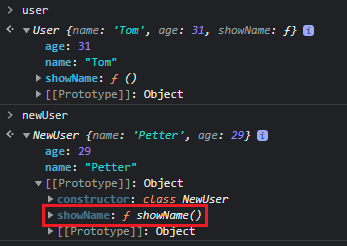

Class
=============

**Class**는 ES6에 추가된 객체를 생성하기 위한 템플릿이다.   
**생성자 함수**와 **Class**를 비교해보자.
```javascript
// 생성자 함수
const User = function(name, age){
    this.name = name;
    this.age = age;
    this.showName = function(){
        console.log(this.name);
    };
};

const user = new User('Tom', 31); // User {name: 'Tom', age: 31, showName: ƒ}

// Class
class NewUser {
    constructor(name, age){
        this.name = name;
        this.age = age;
    }
    showName(){
        console.log(this.name);
    }
};

const newUser = new NewUser('Petter', 29); // NewUser {name: 'Petter', age: 29}
```
**Class**에는 **constructor**가 있으며 이는 객체를 만들어주는 메소드다.   
또한 showName과 같이 **Class**내에 정의한 메소드는 생성된 객체의 **prototype**에 저장된다.

  

**생성자 함수**로 생성된 user는 객체 내부에 showName이 있고, **Class**로 생성된 newUser는 **prototype** 내부에 있다.   
**생성자 함수**에서도 **Class**처럼 구현하기 위해선 아래와 같이 변경하면 된다.
```javascript
const User = function(name, age){
    this.name = name;
    this.age = age;
    // this.showName = function(){
    //     console.log(this.name);
    // };
};

User.prototype.showName = function(){
    console.log(this.name);
};
```
그렇다면 단순히 문법의 편의성을 위해서 **Class**가 탄생한 것일까?   
**생성자 함수**의 경우 **new** 연산자를 적지 않더라도 에러가 발생하지 않는다.   
하지만 **Class**는 TypeError가 발생하여 실수를 사전에 방지할 수 있다.

  

newUser의 **constructor**를 보면 **Class**라고 명시되어 있어 **Class**를 통해 생성되었다는 것을 알 수 있고 이러한 경우 **new**없이 호출하면 에러가 발생하도록 설계되어있다.

 