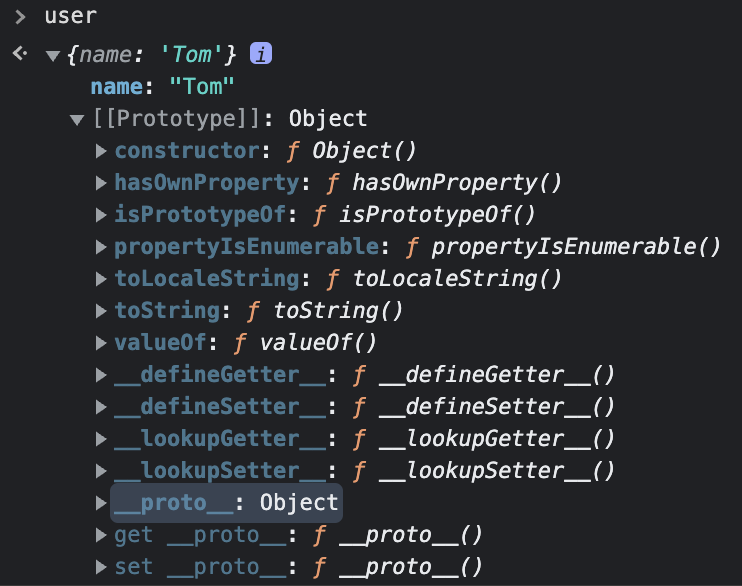

상속과 프로토타입
=============

객체에는 자신이 프로퍼티를 가지고 있는지 확인하는 **hasOwnProperty**라는 함수가 있다.
```javascript
const user = {
    name : 'Tom'
};

user.hasOwnProperty('name'); // true
user.hasOwnProperty('age'); // false
```
그렇다면 **hasOwnProperty** 함수는 어디에서 오는 걸까?   
바로 여기에 있다.   
   

이를 **프로토타입**이라고 한다.   
객체에서 프로퍼티를 읽는데 존재한다면 탐색을 멈추고 없다면 **프로토타입**에서 찾는다.
```javascript
const user = {
    name : 'Tom',
    hasOwnProperty : function(){
        console.log('Hello');
    }
};

user.hasOwnProperty(); // 'Hello'
```
   
**상속**이라는 개념을 통해 **프로토타입**의 동작 원리를 알아보자.
```javascript
const car = {
    wheels : 4,
    drive : function(){
        console.log('drive...');
    }
};

const bmw = {
    color : 'black',
    owner : 'Tom'
};

bmw.__proto__ = car;

console.log(bmw); // {color: 'black', owner: 'Tom'}
bmw.drive(); // 'drive...'
```
bmw 객체에는 color와 owner 밖에 없지만 drive를 실행 했을때 상속된 car를 탐색하여 찾는다.   
또한 상속은 계속 이어질 수 있다.
```javascript
const x5 = {
    color : 'gray'
};

x5.__proto__ = bmw;

x5.color; // 'gray'
x5.owner; // 'Tom'
x5.drive(); // 'drive...'
```
bmw는 car를 상속했고 x5는 bmw를 상속했다.   
color는 x5도 갖고있기 때문에 x5에서 찾은 후 탐색을 멈추었고 owner는 bmw로 올라가 탐색, drive는 bmw의 위인 car까지 올라가 탐색한다.   
이것을 **prototype chain**이라고 한다.   

**for in**을 사용해 탐색해보기
```javascript
for(proto in x5){
    if(x5.hasOwnProperty(proto)){
        console.log('yes', proto);
    }else{
        console.log('no', proto);
    }
};

// yes color
// no owner
// no wheels
// no drive

Object.keys(x5); // 'color'
Object.values(x5); // 'gray'
/*키, 값과 관련된 객체 내장메소드는 상속된 프로퍼티는 나오지 않는다.*/
```

생성자 함수를 이용해보기
```javascript
const Bmw = function(color){
    this.color = color;
};

Bmw.prototype.wheels = 4;
Bmw.prototype.drive = function(){
    console.log('drive...');
};

const x5 = new Bmw('gray');
const x6 = new Bmw('black');

x5.wheels; // 4
x6.drive(); // 'drive...'
```
생성자 함수가 새로운 객체를 생성할때 그 객체는 생성자의 **instance**라고 불린다.   
자바스크립트에선 **instanceof** 연산자로 확인할 수 있다.   
또한 생성자 함수로 생성된 **instance**객체에는 **constructor**라는 프로퍼티가 있다.   
**constructor**는 생성자를 가르킨다.
```javascript
x5 instanceof Bmw; // true
x5.constructor === Bmw; // true

/*간결한 코드를 위해 prototype을 덮어쓸 경우 constructor가 사라지기 때문에 명시해주자*/
Bmw.prototype = {
    constructor : Bmw,
    wheels : 4,
    drive : function(){
        console.log('drive...');
    }
};
```