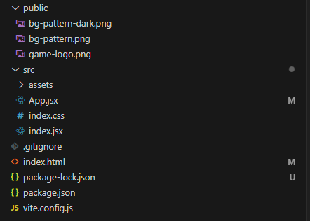
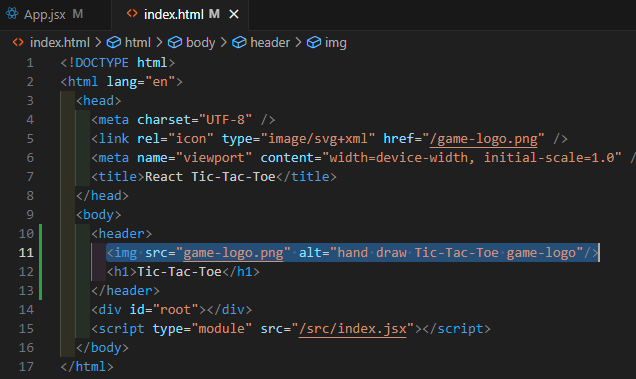

이미지 저장소 - public vs assets
=============

### public/폴더
이미지를 **public/폴더** 에 저장하면 index.html 혹은 index.css 파일에서 직접 참조할 수 있다.   
   
   

이러한 이유는 **public/** 에 저장된 이미지(파일)이 프로젝트 개발 서버 및 빌드 프로세스에 의해 **공개적으로 제공** 되기 때문이다.   
index.html과 마찬가지로, 이 파일들은 브라우저 내에서 직접 방문할 수 있다.   
ex) localhost:5173/some-image.jpg   

### src/assets/폴더
이미지나 파일를 **src** 폴더 또는 **src/assets/(src폴더 어디든)** 과 같은 하위 폴더에 저장하면 이는 공개적으로 제공되지 않는다.   
localhost:5173/some-image.jpg과 같은 방식으로 웹사이트 방문자가 접근할 수 없다.   
대신 이러한 파일은 코드 파일에서 사용할 수 있다.   
코드 파일에가져온 이미지는 빌드 프로세스에 의해 인식되어 최적화되며, 웹사이트에 제공하기 직전에 **public/** 폴더에 **삽입** 된다.   

### 어떤 폴더를 사용해야 할까?
빌드 프로세스에 의해 처리되지 않는 정적인 이미지나 파일은 **public/** 폴더를 사용한다.   
예를 들면 index.html이나 파비콘과 같은 이미지가 좋은 후보다.   
반면 **컴포넌트 내** 에서 사용되는 이미지는 일반적으로 **src/** 폴더에 저장되어야한다.