React - vanilla CSS & styled-components
============

Vanilla CSS
----------
### 장단점
- 장점   
1. 말 그대로 바닐라 CSS이기 때문에 특별한 관례를 따르지 않아도 된다.
2. 컴포넌트 파일에서 import해서 사용하니 스타일링을 추가하려는 사람으로 인해 방해를 받거나 간섭을 받지 않고 컴포넌트 작업을 할 수 있다.

- 단점
1. CSS를 알아야 한다.
2. CSS 코드와 규칙은 여러개의 파일로 나누어 특정 컴포넌트 파일로 import하더라도 해당 컴포넌트로 스코핑되지 않는다.   
   즉, 다른 컴포넌트 간에 스타일 충돌이 발생할 수 있다.

### Inline 스타일
style 속성에 중괄호가 필요하고 카멜 표기법 or 작은 따옴표로 key를 지정한다.
> 설정한 jsx 요소에만 영향을 미친다는 장점이 있지만 모든 요소를 개별적으로 스타일하므로 추가와 수정에 효율적이지 않다.
```jsx
<p style={{textAlign: 'center'}}>Inline styling</p>

// 조건부 스타일링
<input style={{backgroundColor: 1 === 1 ? 'red' : 'black'}} />
```

### CSS module
CSS 모듈을 사용하여 스타일 코드와 규칙을 컴포넌트에 스코핑되도록 할 수 있다.   
> 많은 컴포넌트를 사용하는 큰 프로젝트라면 각각 자체의 CSS 파일을 갖게되는 단점도 있다.

CSS 파일명에 .module 패턴을 추가한다.   
이는 기본 빌드 프로세스에 대한 신호로 볼 수 있다.   
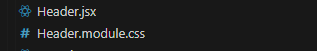   

CSS 모듈을 사용한 컴포넌트에서 아래와 같이 import 한다음 사용하면된다.   
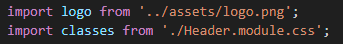   
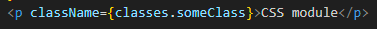   

랜더링된 DOM에 적용된 클래스와 헤더 섹션에 주입된 스타일 살펴보면 이상한 이름이 있는 것을 볼 수 있는데 이는 빌드 툴에 의해 자동으로 생성된 것이다.   
이것이 CSS 모듈의 개념이며 이 클래스 이름은 이제 해당 컴포넌트에 대해 고유하게된다.   
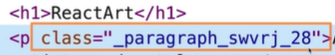   
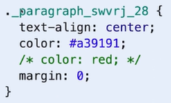   

styled-components
--------
### 개념
styeld-components 패키지는 바닐라 CSS를 기반으로하는 솔루션 중 하나로 CSS 규칙이나 스타일을 별도의 파일이나 인라인 스타일로 지정하지 않고 해당 패키지의 도움을 받아 생성된 특별한 컴포넌트내에서 정의하는 것이다.   
터미널에서 npm install styled-components를 실행하여 설치 할 수있다.

### 적용하기
styled-components로부터 styled를 import하고 자바스크립트 객체인 styled를 사용하여 다른 속성에 접근한다.   
매핑되는 속성들은 해당 html 요소를 개발자가 설정한 스타일을 가지는 개별 컴포넌트로 만들어준다.   
작성한 요소 속성 다음 백틱 안에 원하는 스타일을 설정하면 된다.   
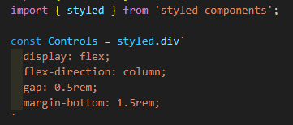
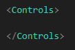   

적용된 스타일을 살펴보면 styled-components는 고유한 CSS 클래스 이름은 생성하고 헤더 섹션에서 해당 클래스에대해 개발자가 작성한 CSS 규칙을 정의한다.   
그런 다음 생성된 클래스를 요소에 추가한다.   
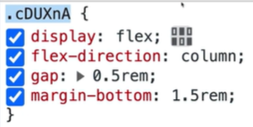
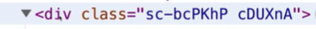   

조건부 스타일링 또한 가능하며 styled-components 스타일링 코드에서만 사용하고 싶은 속성에는 달러 기호를 사용하는 것이 일반 규칙이다.   
이렇게하면 내장 속성과 출동하지 않는다.   
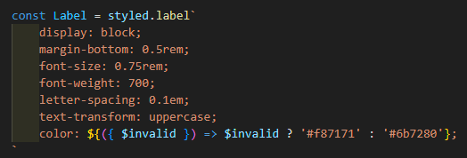
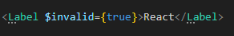   

### 가상 선택자, 중첩 규칙 & 미디어 쿼리
& 기호를 사용하여 해당 요소내의 다른 요소들의 규칙이나 미디어 쿼리를 작성한다.   
아래 사진처럼 & 기호가 header 요소를 가르키는거라 생각하면 될 것같다.   
> & 다음 공백이 있어야 해당 요소의 하위 요소가 목표가된다.

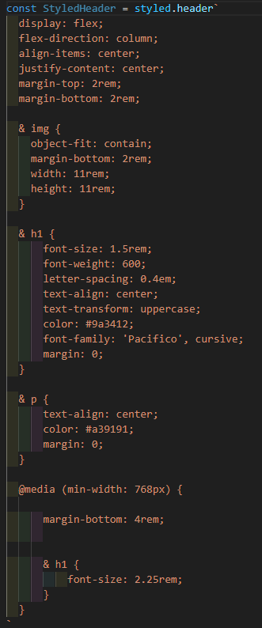   

가상(pseudo) 선택자의 경우 아래와 같이 작성한다.   
> 해당 요소 자체가 목표가 되어야 하는 경우 & 기호다음 빈 공간 없이 작성한다.

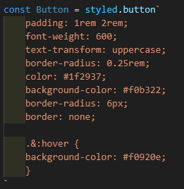   

### 장단점
- 장점
1. 꽤 간단하며 많은 추가 작업이 필요하지 않다.
2. 스타일이 자동으로 범위가 지정되어 CSS 규칙이나 스타일 충돌이 발생하지 않는다.

- 단점
1. 바닐라 CSS를 알아야한다.
2. 스타일이 컴포넌트와 동일한 파일 혹은 옆에 정의 되어 있기에 강한 분리가 없다.
3. 버튼이나 입력 컴포넌트와 같은 비교적 작은 래퍼(warpper) 컴포넌트가 많이 생기는 경향이 있다.