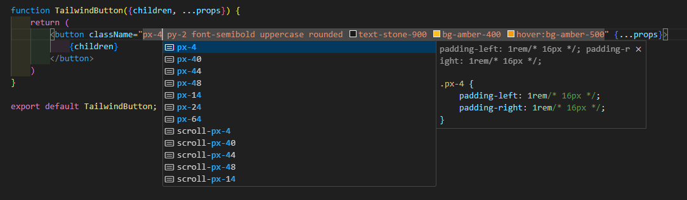

Tailwind CSS
----------
Tailwind CSS는 어떤 웹 프로젝트에서든 사용할 수 있는 CSS 프레임워크로 HTML 요소에 **mb-6** , **flex** 와 같이 미리 정의된 클래스를 추가하여 스타일링 할 수 있다.   

### 설치
설치법은 공식 문서에 잘 나와있다.   
본인은 vite를 사용하므로 [관련 페이지](https://tailwindcss.com/docs/guides/vite) 에서 설치법을 찾아보았다.   

1. Tailwind CSS를 터미널에서 설치한다.
```yaml
npm install -D tailwindcss postcss autoprefixer
npx tailwindcss init -p
```
2. 설치 후 생성된 tailwind.config.js 파일에서 경로를 구성한다.
```javascript
/** @type {import('tailwindcss').Config} */
export default {
  content: [
    "./index.html",
    "./src/**/*.{js,ts,jsx,tsx}",
  ],
  theme: {
    extend: {},
  },
  plugins: [],
}
```
3. 메인 CSS 파일에 아래 코드를 추가하여 Tailwind CSS 스타일을 추가한다.   
   **@tailwind** 디렉티브는 빌드시에 CSS 코드로 변환된다고 한다.
```css
@tailwind base;
@tailwind components;
@tailwind utilities;
```

### 추천하는 확장 프로그램
Tailwind CSS의 공식 문서에세 정의된 모든 클래스의 이름을 찾아볼 수 있지만 번거로움을 조금이라도 줄이기위한 **Tailwind CSS IntelliSense** 라는 확장 프로그램이 있다.   
이는 Tailwind 팀에서 자체적으로 출시한 것으로 코드를 작성할때 **클래스 이름을 제안** 받고 해당 클래스가 **어떠한 스타일링이 적용되는지** 미리 확인해볼 수 있는 아주 좋은 프로그램이다.   
설치하는 것을 적극 추천한다.   
   
   