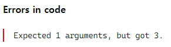

TypeScript란?
=============

### 왜 TypeScript를 사용할까?
우리가 사용하는 브라우저들(크롬, 엣지, 파이어폭스, 사파리 등)은 **TypeScript**를 이해하지 못한다.   
그래서 **Javscript**로 변환해서 로드해야 진행할 수 있다.   
이렇게만 들었을 땐 번거로울 것 같은데 무슨 장점이 있길래 **TypeScript**를 사용하는 걸까?
```javascript
function add(num1, num2) {
    console.log(num1 + num2);
};

add(1,2); // 3
add(1,2,3); // 3
add('Petter', ' Parker'); // 'Petter Parker'
```
위와 같은 코드가 있다고 가정했을 때 add 함수는 숫자를 더하기 위한 목적으로 개발자가 만들었지만 인수를 잘못 넣어도 **Javascript**는 어떠한 힌트도 주지 않는다.   
또한 문자열을 넣어도 정상적으로 작동하여 실수가 분명하더라도 알지 못하거나 직접 찾아봐야한다.   
   
하나의 예시를 더 들어보자.
```javascript
function showNumber(arr) {
    arr.forEach((i) => {
        console.log(i);
    });
};

showNumber([1,2,3]); 
// 1
// 2
// 3

showNumber(1,2,3);
// TypeError: arr.forEach is not a function
```
showNumber 함수는 배열을 받아 반복문을 실행하는 함수인데 배열이 아닌 다른 인수를 받게되면 forEach 메서드가 없어 TypeError가 발생한다.   
이렇게 **Javascript**는 실행되는 시점, 즉 런타임에 타입이 결정되고 오류가 있다면 그 때 발견하게 되는 **동적언어**다.   
반면 **Java**같은 **정적언어**는 컴파일 타임에 타입이 결정되고 오류가 발견된다.   
그래서 코드 작성 시간은 오래 걸리겠지만 초기에 생각을 많이 해서 코드를 작성한다면 안정적으로 작업을 진행할 수 있는 장점이 있다.
**TypeScript**도 이러한 **정적 타입의 언어**이다.   

위에 있는 예제들을 **TypeScript**로 작성 해보자.
콜론과 함께 원하는 type을 적어주면 해당 인수는 지정한 type의 데이터만 들어와야하며 이와 맞지 않는 경우 오류들을 잡아준다.


